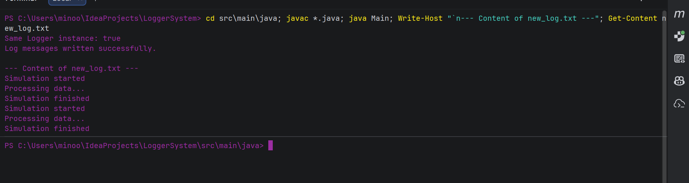

# Logger System

This is a simple Java project using the Singleton design pattern.

The program has one Logger instance. It writes messages to a log file and the file name can also be changed.

I tested the program in the Main class.

## Output

